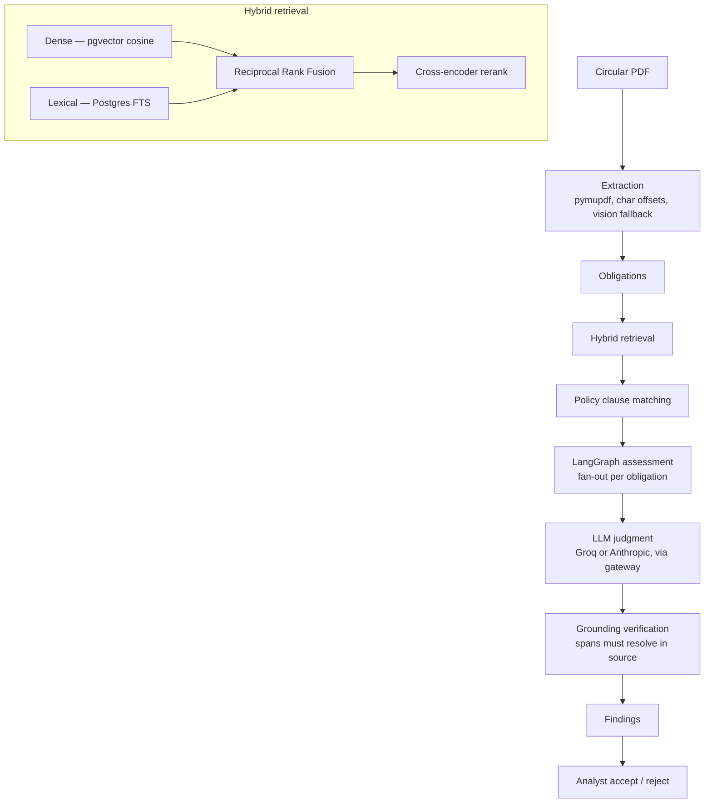

# RegDelta

A regulatory change-impact engine: it reads a regulatory circular, pulls out the obligations it imposes, finds the internal policy clauses each one touches, and produces cited findings whose evidence is checked against the source text before an analyst ever sees them.

When a regulator like SEBI publishes a circular, someone at every regulated firm has to work out what it actually changes: which internal policies it creates work for, which it contradicts, which already cover it, and which it leaves alone. That review is slow, easy to do inconsistently, and hard to audit. RegDelta is my attempt to turn it into a structured, evidence-backed workflow instead of a manual read-through.

> RegDelta is a technical prototype, not legal advice. Every finding is a machine-generated aid that a human analyst accepts or rejects.

## What it does

```
regulatory circular
   → obligations extracted from it
   → relevant internal policy clauses retrieved
   → impact judged per obligation (creates / modifies / conflicts / already-covered / no-match)
   → each judgment's evidence verified against the source text
   → analyst reviews, accepts or rejects
```

The output is a list of findings. Each finding ties one obligation to one policy clause, states the kind of impact, gives a rationale, and — crucially — carries two evidence spans (one into the circular, one into the policy) that have been re-resolved against the original text. If the model quotes something that can't be located in the source, that finding is dropped rather than shown.

## Why I built it

I wanted a project that took a genuinely messy problem — regulatory change management — and did the unglamorous parts properly: document ingestion with character-level provenance, retrieval that actually gets evaluated, and an LLM step whose output is verified rather than trusted. "The model said so" isn't good enough in a compliance setting, so the interesting engineering is in everything that surrounds the model call: retrieval quality, grounding, and an auditable trace of what the agent did.

## How it works



The whole thing runs on one datastore (PostgreSQL + pgvector) and one LLM chokepoint (`app/ai/gateway.py`). Nothing outside the gateway ever constructs a provider client, so switching providers or adding one is a change in a single file.

## What's technically interesting

### Hybrid retrieval
Dense search (pgvector cosine over bge embeddings) and lexical search (Postgres full-text) run in parallel, get combined with Reciprocal Rank Fusion, and the top candidates are re-ranked by a cross-encoder. Both retrievers apply the same filters, so fusion compares like with like. Retrieval that falls below a relevance threshold refuses rather than returning a weak guess.

### Temporal reasoning
Circulars supersede and amend each other. Point-in-time queries answer "what was applicable as of date X?" by respecting those supersession relationships, so the corpus can be read as it stood at any past date rather than only as it stands now.

### Agentic assessment
The assessment is a LangGraph graph that fans out one worker per obligation (they're independent, so there's no reason to serialize them), judges each against its retrieved clauses, verifies grounding with a retry loop, then fans back in to synthesize a memo. Every node execution is persisted and streamed to the UI as a live trace.

### Grounding verification
The judge returns quoted spans, not character offsets — models can quote but can't count. Code then re-resolves each quote against the source text to get real offsets. A finding is only accepted if both its spans resolve; the database keeps a uniqueness constraint as a final safety net and the offsets are asserted against stored data.

### Evaluation
Retrieval is ablated across four modes (dense / lexical / fusion / fusion+rerank) with Recall@K and MRR, using a gold set mined from the corpus's own citation graph. There's also a refusal suite (does it correctly decline out-of-scope questions?) and extraction and grounding checks. See [docs/evaluation.md](docs/evaluation.md) for methodology and current numbers — the README deliberately doesn't hard-code benchmark figures that drift.

## Demo flow

Dashboard → open a circular → inspect its obligations and search the corpus → **Run new assessment** → watch the agent trace fill in live → review findings → open a finding's side-by-side evidence → accept or reject. Each run creates a fresh assessment with its own run ID and trace; earlier runs are kept as history.

## Tech stack

| Layer | Tools |
|---|---|
| Frontend | React, TypeScript, Vite, Tailwind, TanStack Query |
| Backend | FastAPI, SQLAlchemy 2.0, Pydantic, Alembic |
| AI | LangGraph, a configurable LLM gateway (Groq / Anthropic), bge embeddings, bge cross-encoder |
| Data | PostgreSQL 16, pgvector, Postgres full-text search |
| Evaluation | Recall@K / MRR ablation, refusal tests, grounding checks |

## Running locally

You need Docker and Python 3.11+. Everything except the LLM assessment runs fully offline — ingestion, search, point-in-time queries, and the evaluation harness need no API key. Running an assessment needs one real LLM call, and the default provider is **Groq**, whose free tier is enough for the demo.

Get a free key at <https://console.groq.com/keys>. It's still a key — the demo isn't keyless — but it doesn't require a paid subscription.

```bash
cp .env.example .env          # then set GROQ_API_KEY=... in .env
docker compose up -d postgres

# backend (editable install puts `app` on the import path)
python -m venv backend/.venv && backend/.venv/Scripts/activate   # Windows
# source backend/.venv/bin/activate                              # macOS/Linux
pip install -e "backend[dev]"
cd backend && alembic upgrade head && cd ..

# data: corpus → ingest → citation graph → policy pack → embeddings → gold set
python -m ingestion.seed
python -m ingestion.extract_obligations --mode rules

# frontend
cd frontend && npm install && cd ..
```

Then run the two servers in separate terminals:

```bash
python backend/run_api.py --reload   # http://localhost:8000  (API docs at /docs)
cd frontend && npm run dev           # http://localhost:5173
```

Open <http://localhost:5173>, go to **Circulars**, open one, and choose **Run new assessment**.

On Windows, `make` isn't installed by default — the commands above are the same steps `make setup && make seed` runs. `run_api.py` (not raw `uvicorn`) is required because psycopg's async driver can't use Windows' default event loop, which the launcher fixes. To use Anthropic instead of Groq, set `LLM_PROVIDER=anthropic`, `ANTHROPIC_API_KEY`, and a `LLM_MODEL`/`VISION_MODEL` for that provider.

## Data and limitations

- **The corpus is synthetic.** The default demo corpus is generated deterministically from eight topic templates (`ingestion/generate_corpus.py`) — it is *not* real SEBI guidance, and is used so the demo and evaluation are reproducible without presenting generated text as real regulation. `ingestion/scrape_sebi.py` targets the real site and is kept for that purpose.
- **The policy pack is fictional.** `data/policy_packs/` is a made-up compliance manual for a made-up broker.
- **Single-user and local.** No authentication, multi-tenancy, or cloud deployment — deliberate exclusions for a portfolio prototype, not oversights.
- **An LLM provider key is required** for the full assessment (Groq by default, Anthropic optionally). Everything else runs offline.
- **Model output needs review.** Findings are analyst aids, not decisions, and this is not legal advice.
- **SEBI-focused.** The architecture generalizes to other regulators, but only SEBI is modelled here.

## Evaluation

Retrieval quality, refusal behaviour, extraction, and grounding are all measured rather than asserted. The gold set for retrieval comes from the citation graph: when one circular's paragraph cites another, that's a relevance judgement for free. Methodology, the four-mode ablation, and the refusal-suite bug it caught are written up in [docs/evaluation.md](docs/evaluation.md); machine-readable reports live under [`evaluation/reports/`](evaluation/reports/).

## Project structure

```
backend/
  app/
    ai/            gateway, LangGraph graph, retrieval, extraction, grounding
    routers/       HTTP endpoints (incl. the SSE trace stream)
    services/      orchestration between routers and the AI/db layers
    repositories/  all SQL, one module per aggregate
    db/            SQLAlchemy models + session
  alembic/         migrations
  tests/           backend test suite
frontend/          React + TypeScript app (Vite)
ingestion/         corpus generation, PDF ingest, citation graph, embeddings, seed
evaluation/        retrieval ablation, refusal/extraction suites, reports
mcp_server/        MCP server exposing retrieval as tools
docs/              architecture, reading guide, evaluation, ADRs
```

New to the code? [docs/reading-guide.md](docs/reading-guide.md) walks the source in dependency order and points at the parts worth reading first.

## Future work

- Ingest real regulatory documents (the scraper exists; the site renders client-side, so it needs a headless browser this project doesn't currently depend on).
- A larger, human-labelled evaluation set to complement the citation-graph gold set.
- Authentication and multi-user support if it ever moved past a local tool.
- Background processing for long assessments instead of a request-scoped background task.


